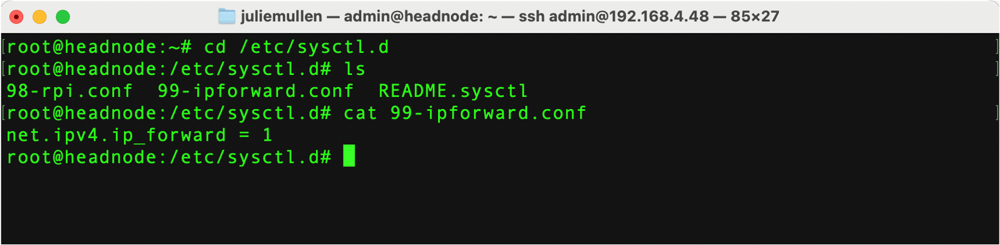

The first step in setting up our network is to set the IP Table rules:

To start, connect to the headnode and open a terminal window and become root. 

!!! danger "Be careful with sudo su -
    Root is powerful.  We can always back out and redo everything so be cautious but not afraid.

To become root, at the Linux command line, execute the command
```
   sudo su -
```

As root, we will create a new file named '99-ipforward.conf' in /etc/systemctl.d.  
Setting net.ipv4.ip_forward=1 will enable forwarding of network traffic to the appropriate network.

-   Navigate to /etc/systemctl.d using the linux command

    ``` 
       cd /etc/sysctl.d
    ``` 

-   Create the file '99-ipforward.conf' using your favorite editor. The example here uses vi/vim.

    ``` 
      vi 99-ipforward.conf
    ```

-   Add the line: 'net.ipv4.ip_forward = 1'
    


# Setup IPtables network routing rules

```bash
root@headnode$> iptables -t nat -A POSTROUTING -o wlan0 -j MASQUERADE
root@headnode$> iptables -A FORWARD -i eth0 -o wlan0 -j ACCEPT
root@headnode$> iptables -A FORWARD -i wlan0 -o eth0 -m state  --state  ESTABLISHED,RELATED -j ACCEPT
```


