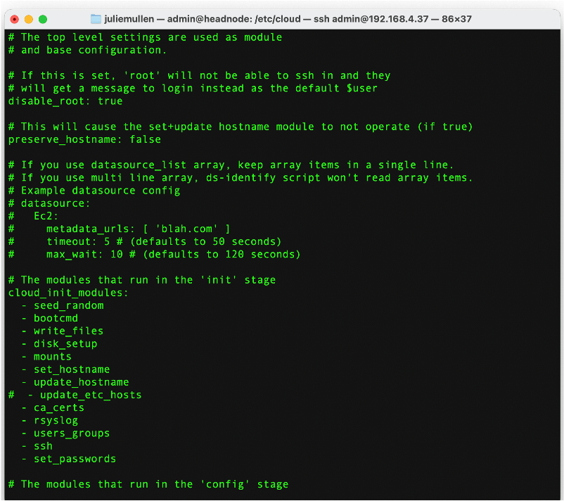
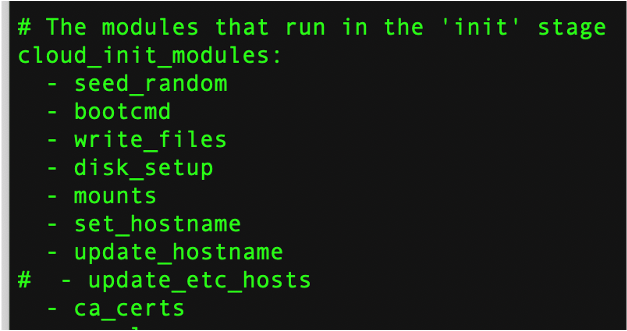

### Installng the OS 
Once you have written the OS onto the USB drive, you want to install it into the node.  

1. Insert the USB Drive into the Pi
2. Connect the Pi to power
3. Connect the Pi to the Monitor using the micro-HDMI to HDMI cable
4. Connect a keyboard
5. Connect a mouse

When the monitor comes up, you should see the Raspbian Desktop.  


Open a terminal window.  User CTTL + Shift + '+' to increate the size and font of the terminal window.

#### Confirm that wifi is disabled on the compute node

Look for the WiFi symbol in the  upper right corner. It should have a slash through it indicating that there is no connectivity.


### Confirming the OS customizations on each node
We made some customizations to our OS and before moving to the next node you should confirm that those customization were properly applied.
1. check to see that the node is named correctly, at the Linux command line, type the command ```hostname```, the response should be ```node_number```	
2. check to see that SSH is enabled, at the Linux command line execute (type) the command ```sudo systemctl status sshd```.  The response should be ```active```.

#### If the customizations were not correctly applied
Open a terminal window and type "raspi-config" at the command line
This will bring up crude dialog box that will allow you to set the nodename and enable ssh.  

### Disable Cloud Control

The standard Raspian OS configuration adds a "feature" that enabled cloud control.  
This feature interferes with our ability to create the network we need to support the distributed cluster.  
In particular, Cloud Control resets the /etc/host file that we use to inform the headnode and compute nodes of each other's existence.

It is important that you disable cloud control. To disable Cloud Control updates requires elevated privileges.


#### Elevated Privileges:

!!! note "You will need root privileges to execute many of the commands for configuring the cluster. Be careful
          with this power - you can change anything which can mangle your system"


You have 2 options for gaining elevated privileges:
-   use ```sudo``` before each command.  You will be asked for your password
-   execute ```sudo su - ``` and become root

Once you have sudo privileges:
1.   Navigate to /etc/cloud, using the Linux command:
```
   cd /etc/cloud
```
2.   Edit the cloud.cfg file, (as root) using the Linux command:
```
  sudo vi cloud.cfg
```
3.   Find the line where the etc/hosts are updated, look for "update_etc_hosts"

4.   Comment out that line by inserting a '#' at the beginning of the line

5.   Save the file and close it.

### Configure SSH with Password Authentication

Remote connections to the TX-Pi cluster from our laptops will make it easier for us to configure the system
and allow multiple users to access the system concurrently.

We need to edit /etc/ssh/sshd_config as root. As above, use ```sudo`` before each command or become root
by executing the command ```sudo su -```.


Navigate to /etc/ssh and open the file with nano or vi.
```
    cd /etc/ssh
    vi sshd_config
```
Starting with “LoginGraceTime”, ending with Max Sessions, make the following edits

-   LoginGraceTime 2m: Remove the hashtag at the start of the line
-   PermitRootLogin: Change 'prohibit password' to 'yes'
-   StrictModes yes: Remove the hashtag at the start of the line
-   MaxAuthTries 6: Remove the hashtag at the start of the line
-   MaxSessions 10: Remove the hashtag at the start of the lin

Scroll down in the file and find "PasswordAuthentication" Confirm or update so that
it says:
```
 PasswordAuthentication yes
```

To save the configuration changes, restart ssh daemon (sshd).  At the command line type.
```
   systemctl restart sshd


  


