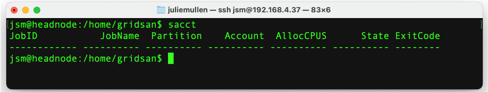

# Adding users to the cluster

Unlike desktops or even small home clusters, HPC-Supercomputing systems are able to provide resources to a broad range of 
users.  The tools that we have configured, such as the shared file system and resource manager (SLURM, in our case) 
allow users to submit jobs knowing that the job will launch when the appropriate resources are available and their
application will be able to obtain the necessary data from the shared file system.

To use an HPC/Supercomputing system, a user needs

-   A user home directory in /home/gridsan/ 
-   Their username and password added to /etc/passwd
-   To be able to connect between nodes passwordlessly
-   Public/private pair of ssh keys
-   Public key added to /home/gridsan/<username>/.ssh/authorized_key file
-   To be added to the slurm database

We will do this via a script.

## Creating User Accounts

-   Download the `newuser.sh` script to the headnode of your cluster
-   As root on the headnode, run the script 
```
   root@headnode$> ./newuser.sh
```
-   Ask the user to answer the prompts
    -   Enter a username
    -   Enter a password and confirm the password

-   The script will:
    -   Create a user account in /home/gridsan
    -   Generate the username and password to /etc/passwd
    -   Generate the ssh key pair for use between cluster nodes
    -   Add the public ssh key to the ~/.ssh/authorized_keys file on the cluster
    -   Add the user to the Slurm database

## Confirm the new account

-   From a laptop, use the IP address of the headnode and login to the headnode using the new user credentials
-   The account will exist, but the home directory will be empty
-   Test to see that the user is in the Slurm database by executing the command `sacct`. This should return something that
    looks like:

  

